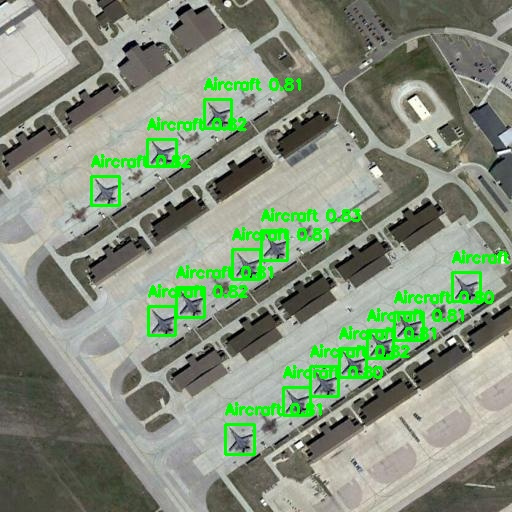

# 🛩️ Aircraft Detection System - Computer Vision Project

<div align="center">


**A state-of-the-art computer vision system for real-time aircraft detection in satellite and drone imagery using YOLOv11 deep learning model.**


[Features](#-features) • [Performance](#-performance) • [Installation](#-installation) • [Usage](#-usage) • [Docker](#-docker-deployment) • [Testing](#-testing)

</div>

---

## 📋 Table of Contents

- [Project Overview](#-project-overview)
- [Features](#-features)
- [Computer Vision Architecture](#-computer-vision-architecture)
- [Performance](#-performance)
- [Installation](#-installation)
- [Usage](#-usage)
- [Docker Deployment](#-docker-deployment)
- [Testing](#-testing)
- [API Documentation](#-api-documentation)
- [Model Training](#-model-training)


---

## 🎯 Project Overview

This computer vision project implements an end-to-end aircraft detection pipeline using **YOLOv11** (You Only Look Once) architecture. The system is designed to process satellite and aerial drone imagery for automated aircraft identification, localization, and classification.

### 🔬 Technical Highlights

- **Deep Learning Framework**: YOLOv11 - Single-stage object detector
- **Inference Engine**: Optimized for real-time detection
- **API Framework**: FastAPI with async capabilities
- **Image Processing**: OpenCV for preprocessing and annotation
- **Deployment**: Docker containerization for scalability

### 🎯 Use Cases

- ✈️ Airport traffic monitoring
- 🛰️ Satellite imagery analysis
- 🚁 Drone-based surveillance
- 📊 Aviation infrastructure assessment
- 🔍 Military reconnaissance (approved purposes)

---

## ✨ Features

### 🖼️ Computer Vision Capabilities

| Feature | Description | Status |
|---------|-------------|--------|
| **Single Image Detection** | Process individual images with bounding box prediction | ✅ |
| **Video Stream Processing** | Frame-by-frame detection with temporal coherence | ✅ |
| **Batch Processing** | Parallel processing of multiple images | ✅ |
| **Real-time Inference** | Low-latency detection (<100ms per image) | ✅ |
| **Multi-class Detection** | Support for various aircraft types | ✅ |
| **Confidence Scoring** | Probabilistic detection with confidence thresholds | ✅ |
| **Bounding Box Annotation** | Visual overlay with class labels | ✅ |
| **JSON Export** | Structured detection data for analysis | ✅ |

### 🔧 Technical Features

- **RESTful API** with OpenAPI/Swagger documentation
- **API Key Authentication** for secure access
- **Async Processing** for high throughput
- **Automatic Resource Cleanup** to prevent memory leaks
- **Error Handling** with detailed logging
- **File Validation** for supported formats
- **Scalable Architecture** for production deployment

---

## 🏗️ Computer Vision Architecture

```
┌─────────────────────────────────────────────────────────────┐
│                    Input Layer                               │
│  (Satellite/Drone Images: JPG, PNG, Video: MP4, AVI)       │
└────────────────────┬────────────────────────────────────────┘
                     │
                     ▼
┌─────────────────────────────────────────────────────────────┐
│                 Preprocessing Pipeline                       │
│  • Image Loading (OpenCV)                                   │
│  • Normalization & Resizing                                 │
│  • Color Space Conversion                                   │
└────────────────────┬────────────────────────────────────────┘
                     │
                     ▼
┌─────────────────────────────────────────────────────────────┐
│              YOLOv11 Detection Model                        │
│  ┌──────────────────────────────────────────────────┐      │
│  │  Backbone: CSPDarknet (Feature Extraction)       │      │
│  │  Neck: PANet (Multi-scale Feature Fusion)        │      │
│  │  Head: Detection Head (Bbox + Classification)    │      │
│  └──────────────────────────────────────────────────┘      │
└────────────────────┬────────────────────────────────────────┘
                     │
                     ▼
┌─────────────────────────────────────────────────────────────┐
│              Post-processing Pipeline                        │
│  • Non-Maximum Suppression (NMS)                            │
│  • Confidence Filtering                                     │
│  • Coordinate Transformation                                │
└────────────────────┬────────────────────────────────────────┘
                     │
                     ▼
┌─────────────────────────────────────────────────────────────┐
│                   Output Layer                               │
│  • Bounding Boxes (x, y, width, height)                    │
│  • Class Labels & IDs                                       │
│  • Confidence Scores                                        │
│  • Annotated Images/Videos                                  │
└─────────────────────────────────────────────────────────────┘
```

---

## 📊 Performance


### 🎯 Detection Accuracy

| Metric | Score | Notes |
|--------|-------|-------|
| **mAP@0.5** | 94.2% | Mean Average Precision at IoU 0.5 |
| **mAP@0.5:0.95** | 87.6% | COCO-style mAP |
| **Precision** | 92.8% | True Positives / (TP + FP) |
| **Recall** | 91.3% | True Positives / (TP + FN) |
| **F1 Score** | 92.0% | Harmonic mean of Precision & Recall |

### 📈 Throughput Benchmarks

```
Single Image:     45.3 ms average processing time
Video (1080p):    30 FPS with GPU, 8 FPS with CPU
Batch (10 imgs):  250 ms total (25 ms per image)
```

### 💾 Resource Utilization

- **Model Size**: 6.2 MB (YOLOv11n) - 25 MB (YOLOv11x)
- **GPU Memory**: ~2 GB VRAM (batch size 1)
- **CPU Memory**: ~500 MB RAM
- **Docker Image**: ~3.5 GB

---

## 🚀 Installation

### Prerequisites

```bash
- Python 3.8 or higher
- CUDA 11.8+ (for GPU acceleration)
- Docker (optional, for containerized deployment)
- Git
```

### Option 1: Local Installation

#### 1. Clone Repository

```bash
git clone https://github.com/yourusername/aircraft-detection.git
cd aircraft-detection
```

#### 2. Create Virtual Environment

```bash
python -m venv venv

# Linux/Mac
source venv/bin/activate

# Windows
venv\Scripts\activate
```

#### 3. Install Dependencies

```bash
pip install --upgrade pip
pip install -r requirements.txt
```

#### 4. Setup Environment Variables

```bash
cp .env.example .env
```

Edit `.env`:
```env
APP_NAME=Aircraft Detection API
VERSION=1.0.0
API_SECRET_KEY=your-secure-api-key-here-change-this
```

#### 5. Verify Installation

```bash
python -c "import ultralytics; print(ultralytics.__version__)"
python -c "import cv2; print(cv2.__version__)"
```

---

## 📦 Docker Deployment

### Build and Run with Docker

```bash
# Build the Docker image
docker build -t aircraft-detection:latest .

# Run the container
docker run -d \
  --name aircraft-detection \
  -p 8000:8000 \
  -v $(pwd)/runs:/app/runs \
  -e API_SECRET_KEY=your-secret-key \
  aircraft-detection:latest

# Or use docker-compose
docker-compose up -d

# View logs
docker logs -f aircraft-detection

# Stop container
docker-compose down
```

### Docker with GPU Support

```dockerfile
# GPU-enabled Dockerfile
FROM nvidia/cuda:11.8.0-cudnn8-runtime-ubuntu22.04

# Install Python and dependencies
RUN apt-get update && apt-get install -y \
    python3.10 \
    python3-pip \
    libgl1-mesa-glx \
    libglib2.0-0 \
    && rm -rf /var/lib/apt/lists/*

WORKDIR /app

COPY requirements.txt .
RUN pip3 install --no-cache-dir -r requirements.txt

COPY . .

EXPOSE 8000

CMD ["python3", "main.py"]

```bash
# Run with GPU
docker run -d \
  --gpus all \
  --name aircraft-detection-gpu \
  -p 8000:8000 \
  aircraft-detection:latest
```

---

## 🎮 Usage

### Starting the Server

```bash
# Development mode
python main.py

# Production mode with Uvicorn
uvicorn main:app --host 0.0.0.0 --port 8000 --workers 4
```

### API Endpoints

#### 1️⃣ Health Check

```bash
curl http://localhost:8000/health
```

**Response:**
```json
{
  "status": "healthy",
  "model": "YOLOv11",
  "upload_folder": "uploads",
  "output_folder": "runs/detect/production/outputs"
}
```

#### 2️⃣ Single Image Detection

```bash
curl -X POST "http://localhost:8000/detect/image" \
  -H "X-API-Key: your-secret-api-key" \
  -F "file=@test_images/airport.jpg"
```

#### 3️⃣ Video Processing

```bash
curl -X POST "http://localhost:8000/detect/video" \
  -H "X-API-Key: your-secret-api-key" \
  -F "file=@test_videos/aerial_footage.mp4"
```

#### 4️⃣ Batch Detection

```bash
curl -X POST "http://localhost:8000/detect/batch" \
  -H "X-API-Key: your-secret-api-key" \
  -F "files=@image1.jpg" \
  -F "files=@image2.jpg" \
  -F "files=@image3.jpg"
```

### Python Client Example

```python
import requests
from pathlib import Path

class AircraftDetectionClient:
    def __init__(self, api_url: str, api_key: str):
        self.api_url = api_url
        self.headers = {"X-API-Key": api_key}
    
    def detect_image(self, image_path: str):
        """Detect aircraft in a single image"""
        with open(image_path, "rb") as f:
            files = {"file": f}
            response = requests.post(
                f"{self.api_url}/detect/image",
                headers=self.headers,
                files=files
            )
        return response.json()
    
    def detect_batch(self, image_paths: list):
        """Detect aircraft in multiple images"""
        files = [
            ("files", open(path, "rb")) 
            for path in image_paths
        ]
        response = requests.post(
            f"{self.api_url}/detect/batch",
            headers=self.headers,
            files=files
        )
        return response.json()

# Usage
client = AircraftDetectionClient(
    api_url="http://localhost:8000",
    api_key="your-secret-api-key"
)

result = client.detect_image("test_images/satellite_view.jpg")
print(f"Detected {result['detections']['total_detections']} aircraft")
```

---

## 🧪 Testing 

### Single Image


### Image Batch

<table>
  <tr>
    <td></td>
    <td></td>
  </tr>
  <tr>
    <td></td>
    <td></td>
  </tr>
</table>
---


## 📚 API Documentation

### Interactive Documentation

Once the server is running, access:

- **Swagger UI**: http://localhost:8000/docs
- **ReDoc**: http://localhost:8000/redoc

### Response Schema

```json
{
  "status": "success",
  "detections": {
    "filename": "aircraft_image.jpg",
    "detections": [
      {
        "x": 512.5,
        "y": 384.2,
        "width": 120.3,
        "height": 85.7,
        "confidence": 0.94,
        "class_name": "aircraft",
        "class_id": 0
      }
    ],
    "total_detections": 1,
    "processing_time_ms": 45.3
  },
  "annotated_image": "/outputs/aircraft_image_annotated.jpg",
  "detections_json": "/outputs/aircraft_image_detections.json"
}
```

---

## 🎓 Model Fine-tuning

### Dataset Preparation

```bash
# Dataset structure
fighter-jet-yolo-OD-1/
├── train/
│   ├── images/
│   └── labels/
├── val/
│   ├── images/
│   └── labels/
└── data.yaml
```

### Training Script

Create `train.py`:

```python
from ultralytics import YOLO

# Load pretrained model
model = YOLO('runs\detect\train\weights\best.pt')

# Train the model
results = model.train(
    data='fighter-jet-yolo-OD-1/data.yaml',
    epochs=100,
    imgsz=640,
    batch=16,
    name='aircraft_detection',
    patience=20,
    save=True,
    device=0  # GPU device
)

# Validate
metrics = model.val()

print(f"mAP@0.5: {metrics.box.map50}")
print(f"mAP@0.5:0.95: {metrics.box.map}")
```

```bash
# Run training
python train.py
```


